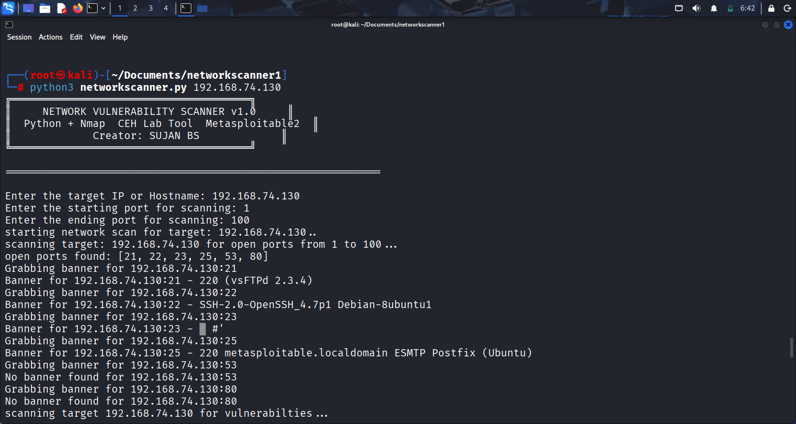

# NetworkScanner v1.0

Python + Nmap based **network** scanner for CEH-style labs.
Scans targets, finds open ports and services, and prints results with a custom SUJAN BS logo.

## Features
- Host discovery and port scanning using Nmap.
- ASCII logo branding from `assets/logo.txt`.
- Tested on Metasploitable2 in Kali Linux lab.

## Usage
undefined

python3 networkscanner.py 192.168.70.130

## Screenshot

